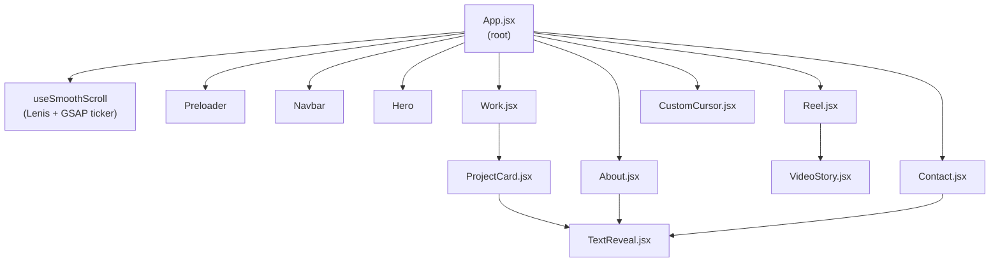
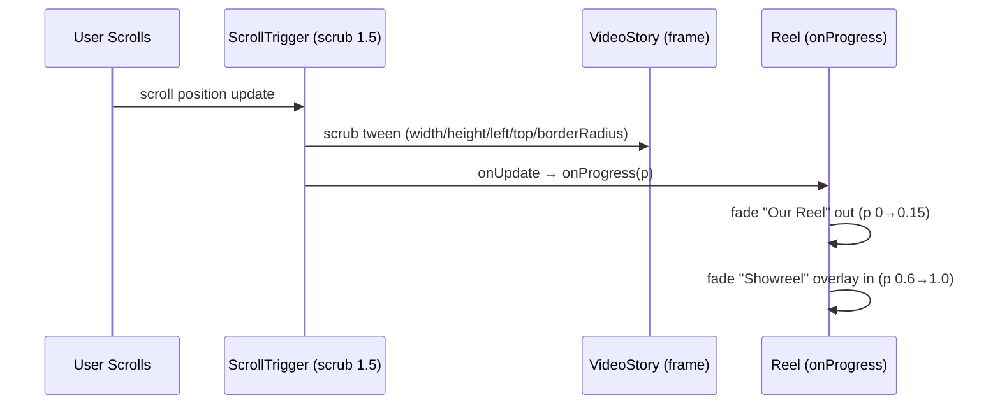

# Design Document: Premium Portfolio Website — Remaining Sections

## Overview

This document covers the architecture, data flow, and implementation detail for the six remaining
components and sections of the EditingKart portfolio site. The previously implemented pieces
(Preloader, Navbar, Hero, Hero3D, TextReveal, useSmoothScroll, index.css) establish every pattern
reused here: GSAP ScrollTrigger for scroll-driven animation, Lenis for smooth scroll, TextReveal
for masked text entrances, and CSS custom properties from the design system.

The user's original feature request was expressed in **JavaScript/JSX** (React), so all code
examples in this document use JSX/JavaScript syntax.

---

## Architecture



---

## Shared Patterns Across All Sections

### TextReveal Usage

Every section heading uses `<TextReveal>` with scroll-based triggering (the default
`triggerOnMount={false}` path). Delay values are staggered per line in increments of `0.12s`.

```jsx
<TextReveal tag="h2" className="section__heading" delay={0}>
  Selected Work
</TextReveal>
```

### ScrollTrigger Cleanup

Every `useEffect` that creates a ScrollTrigger instance must return a cleanup function that kills
the trigger. The pattern used throughout:

```js
useEffect(() => {
  const ctx = gsap.context(() => {
    // ... ScrollTrigger.create(...)
  }, sectionRef);
  return () => ctx.revert(); // kills all triggers created inside ctx
}, []);
```

`gsap.context()` scoped to a section `ref` ensures triggers are scoped to their DOM subtree and
are reliably killed on unmount without tracking individual trigger references.

### CSS Module Co-location

Each section keeps its styles in a sibling `.css` file (e.g., `Reel.css`, `Work.css`). Component-
level files (`VideoStory.jsx`, `ProjectCard.jsx`, `CustomCursor.jsx`) use inline CSS or a matching
`.css` file. No global style leakage.

### Accessibility Defaults

- `<video>` elements get `aria-label` on their wrapper `<div>`.
- `prefers-reduced-motion` is checked in every `useEffect` that spawns animations:
  ```js
  const reduced = window.matchMedia('(prefers-reduced-motion: reduce)').matches;
  const dur = reduced ? 0.001 : 1.0;
  ```

---

## Component: VideoStory.jsx

### Purpose

A controlled wrapper that takes a video source and drives a GSAP ScrollTrigger expansion animation
from a small positioned state to full-screen. `Reel.jsx` owns the sticky container and all copy;
`VideoStory` owns only the `<video>` element and its scroll-driven transforms.

### Props Interface

```jsx
/**
 * VideoStory
 *
 * @prop {string}  src          — path to video file (or "" for placeholder mode)
 * @prop {string}  [poster]     — poster image src shown before video plays
 * @prop {object}  scrollRef    — ref to the outer 300vh scroll container (used as ScrollTrigger trigger)
 * @prop {function} [onProgress] — optional callback(progress: 0–1) called each scrub tick
 * @prop {string}  [className]  — extra class on the wrapper div
 * @prop {string}  [ariaLabel]  — accessible label for the video wrapper (default "Showreel video")
 */
```

### Internal Layout

```
<div className="video-story" ref={wrapperRef}>         ← position: absolute, inset 0 (inside sticky)
  <div className="video-story__frame" ref={frameRef}>  ← this is what GSAP animates
    <video ref={videoRef} ... />                        ← or placeholder div
  </div>
</div>
```

### Initial CSS State (before GSAP)

```css
.video-story__frame {
  position: absolute;
  left: 10vw;
  top: 50%;
  transform: translateY(-50%);
  width: 35vw;
  height: 55vh;
  border-radius: 12px;
  overflow: hidden;
  will-change: width, height, left, top, border-radius;
}
```

On mobile (`max-width: 768px`) the initial state is `width: 90vw; left: 50%; transform: translate(-50%, -50%)`.

### GSAP ScrollTrigger Animation

The expansion is driven by a single timeline with `scrub: 1.5` pinned to the outer 300vh element.

```js
useEffect(() => {
  const frame = frameRef.current;
  const reduced = window.matchMedia('(prefers-reduced-motion: reduce)').matches;

  const ctx = gsap.context(() => {
    const tl = gsap.timeline({
      scrollTrigger: {
        trigger: scrollRef.current,   // outer 300vh wrapper
        start: 'top top',
        end: 'bottom bottom',
        scrub: reduced ? false : 1.5,
        onUpdate: (self) => onProgress?.(self.progress),
      },
    });

    tl.to(frame, {
      width: '100vw',
      height: '100vh',
      left: '0vw',
      top: '0',
      borderRadius: 0,
      ease: 'none',
    });
  }, wrapperRef);

  return () => ctx.revert();
}, [scrollRef, onProgress]);
```

**Why `width/height` instead of `scale` or `clip-path`:** `scale` would distort the video content.
`clip-path` circle-expand looks fine but creates stacking-context issues with the sticky parent.
Animating `width`, `height`, `left`, and `top` directly (with `will-change`) gives full control
over the layout geometry and is what GSAP's `scrub` interpolates cleanly.

### Placeholder Mode

When `src` is empty, `VideoStory` renders a `<div className="video-story__placeholder">` instead
of `<video>`. The placeholder div receives the same `ref` and the same GSAP transforms apply.

---

## Section: Reel.jsx

### Purpose

The 300vh sticky section that wraps `VideoStory`, provides the scroll travel distance, and
orchestrates the text overlays ("Our Reel" fade-out and "EditingKart — 2025 Showreel" fade-in).

### DOM Structure

```
<section id="reel" className="reel" ref={outerRef}>      ← height: 300vh, position: relative
  <div className="reel__sticky" ref={stickyRef}>          ← position: sticky; top: 0; height: 100vh
    <VideoStory src={VIDEO_SRC} scrollRef={outerRef}
                onProgress={handleProgress} />

    <div className="reel__label-enter" ref={labelEnterRef}>
      <TextReveal ...>Our Reel</TextReveal>
    </div>

    <div className="reel__label-exit" ref={labelExitRef}>  ← "Our Reel" — fades out at 0.15 progress
      {/* redundant text visible before VideoStory reveals */}
    </div>

    <div className="reel__overlay-text" ref={overlayTextRef}> ← fades in at 0.6 progress
      EditingKart — 2025 Showreel
    </div>
  </div>
</section>
```

### Text Overlay Sequencing via `onProgress`

Rather than creating three separate ScrollTriggers, the `onProgress` callback from `VideoStory`
drives the text overlays imperatively. This keeps all timing logic in one place.

```js
function handleProgress(p) {
  // Fade "Our Reel" label out when expansion starts
  if (labelRef.current) {
    gsap.set(labelRef.current, { opacity: 1 - p / 0.15 > 0 ? 1 - p / 0.15 : 0 });
  }
  // Fade "EditingKart — 2025 Showreel" in after 60%
  if (overlayRef.current) {
    const fadeFactor = Math.max(0, (p - 0.6) / 0.4);
    gsap.set(overlayRef.current, { opacity: fadeFactor });
  }
}
```

### Sequence Diagram



### Mobile Adjustment

On mobile, `VideoStory` starts at `90vw` centered. Reel also hides the "Our Reel" text label
(`display: none` via media query) since there is less real estate, and the overlay text font-size
scales via `clamp(1rem, 4vw, 2rem)`.

---

## Component: ProjectCard.jsx

### Purpose

A reusable card component that shows a static thumbnail by default and crossfades to a looping
video preview on hover (desktop only).

### Props Interface

```jsx
/**
 * ProjectCard
 *
 * @prop {string}  title       — project title
 * @prop {string}  category    — tag label, e.g. "Brand Film"
 * @prop {string}  year        — e.g. "2024"
 * @prop {string}  [thumb]     — thumbnail image src (or "" for gradient placeholder)
 * @prop {string}  [videoSrc]  — hover preview video src (or "" to skip video)
 * @prop {string}  [href]      — destination link (default "#")
 * @prop {number}  [index]     — card index, used for stagger delay by parent
 */
```

### DOM Structure

```
<a className="project-card" href={href} data-cursor="hover" ref={cardRef}>
  <div className="project-card__media">
    <!-- Thumbnail layer (always rendered) -->
    

    <!-- Video layer (rendered only if videoSrc provided) -->
    <video
      className="project-card__video"
      ref={videoRef}
      src={videoSrc}
      muted loop playsInline preload="none"
      aria-hidden="true"
    />

    <!-- Gradient placeholder shown when thumb is empty -->
    <div className="project-card__placeholder" aria-hidden="true" />
  </div>

  <div className="project-card__info">
    <span className="project-card__category">{category}</span>
    <h3 className="project-card__title">{title}</h3>
    <span className="project-card__year">{year}</span>
    <span className="project-card__arrow" aria-hidden="true">↗</span>
  </div>
</a>
```

### Hover Video Crossfade Mechanism

The video and thumbnail layers are stacked with CSS `position: absolute`. The video starts at
`opacity: 0`. On `mouseenter`, the video element loads and plays, then its opacity transitions
to `1`. On `mouseleave`, opacity returns to `0` and after the transition the video pauses.

```css
.project-card__video {
  position: absolute;
  inset: 0;
  width: 100%;
  height: 100%;
  object-fit: cover;
  opacity: 0;
  transition: opacity 0.4s ease;
}

.project-card__thumb {
  position: absolute;
  inset: 0;
  width: 100%;
  height: 100%;
  object-fit: cover;
}
```

```js
useEffect(() => {
  const card = cardRef.current;
  const video = videoRef.current;
  if (!card || !video) return;

  // Only enable hover video on desktop
  const isMobile = window.matchMedia('(max-width: 768px)').matches;
  if (isMobile) return;

  function onEnter() {
    video.load();           // triggers actual network fetch (preload="none" defers this)
    video.play().catch(() => {}); // swallow autoplay policy errors
    video.style.opacity = '1';
  }
  function onLeave() {
    video.style.opacity = '0';
    // Pause after CSS transition completes (400ms)
    setTimeout(() => { if (video.style.opacity === '0') video.pause(); }, 420);
  }

  card.addEventListener('mouseenter', onEnter);
  card.addEventListener('mouseleave', onLeave);
  return () => {
    card.removeEventListener('mouseenter', onEnter);
    card.removeEventListener('mouseleave', onLeave);
  };
}, []);
```

**Preloading strategy:** `preload="none"` means no video bytes are fetched until hover. `video.load()`
on `mouseenter` begins buffering. This avoids wasting bandwidth for videos the user never hovers.

### Scale Hover via CSS

Card scale-up is CSS-only, no JS needed:

```css
.project-card {
  transition: transform 0.5s cubic-bezier(0.25, 0.46, 0.45, 0.94);
}
.project-card:hover {
  transform: scale(1.04);
}
```

---

## Section: Work.jsx

### Purpose

Renders the "Selected Work" heading and a responsive grid of `ProjectCard` components with a
GSAP staggered entrance animation on scroll.

### Props Interface

`Work` takes no props. Project data is a static array defined in the same file.

### Project Data Shape

```js
const PROJECTS = [
  {
    id: 'p1',
    title: 'Brand Story',
    category: 'Brand Film',
    year: '2024',
    thumb: '',       // fill with real path when assets exist
    videoSrc: '',
    href: '#',
  },
  // ... 2–5 more entries
];
```

### DOM Structure

```
<section id="work" className="work" ref={sectionRef}>
  <div className="work__header">
    <TextReveal tag="h2" className="work__heading">Selected Work</TextReveal>
  </div>
  <div className="work__grid" ref={gridRef}>
    {PROJECTS.map((p, i) => (
      <ProjectCard key={p.id} {...p} index={i} />
    ))}
  </div>
</section>
```

### Staggered Entrance Animation

All cards start at `opacity: 0; transform: translateY(40px)`. A single ScrollTrigger fires when
the grid enters the viewport and staggers the cards in.

```js
useEffect(() => {
  const ctx = gsap.context(() => {
    const cards = gridRef.current?.querySelectorAll('.project-card');
    if (!cards?.length) return;

    const reduced = window.matchMedia('(prefers-reduced-motion: reduce)').matches;

    gsap.from(cards, {
      opacity: 0,
      y: 40,
      duration: reduced ? 0.001 : 0.8,
      stagger: reduced ? 0 : 0.1,
      ease: 'power3.out',
      scrollTrigger: {
        trigger: gridRef.current,
        start: 'top 80%',
        once: true,
      },
    });
  }, sectionRef);

  return () => ctx.revert();
}, []);
```

### Responsive Grid CSS

```css
.work__grid {
  display: grid;
  grid-template-columns: 1fr;          /* mobile: single column */
  gap: 2rem;
}

@media (min-width: 769px) {
  .work__grid {
    grid-template-columns: repeat(2, 1fr);
  }
}

@media (min-width: 1200px) {
  .work__grid {
    grid-template-columns: repeat(3, 1fr);
  }
}
```

---

## Section: About.jsx

### Purpose

Studio bio, three count-up stat counters, and a decorative background element. All text reveals
use `TextReveal` on scroll; the counters use a GSAP tween on a plain object to drive the displayed
value.

### Props Interface

`About` takes no props.

### Stat Data Shape

```js
const STATS = [
  { label: 'Projects Completed', target: 120, suffix: '+' },
  { label: 'Years of Experience', target: 5,   suffix: '+' },
  { label: 'Happy Clients',       target: 80,  suffix: '+' },
];
```

### DOM Structure

```
<section id="about" className="about" ref={sectionRef}>
  <div className="about__bg" aria-hidden="true" />       ← radial gradient decoration

  <div className="about__content">
    <TextReveal tag="h2" className="about__heading">
      About EditingKart
    </TextReveal>

    <TextReveal tag="p" className="about__bio" delay={0.1}>
      {BIO_COPY}
    </TextReveal>

    <div className="about__stats" ref={statsRef}>
      {STATS.map((s, i) => (
        <div key={s.label} className="about__stat">
          <span className="about__stat-number" ref={el => statRefs.current[i] = el}>0</span>
          <span className="about__stat-suffix">{s.suffix}</span>
          <p className="about__stat-label">{s.label}</p>
        </div>
      ))}
    </div>
  </div>
</section>
```

### Count-Up Animation

The counter tween drives an intermediate object `{ val: 0 }` and writes `Math.round(obj.val)` to
the DOM text node. A single ScrollTrigger fires `once: true` when `statsRef` enters the viewport.

```js
useEffect(() => {
  const ctx = gsap.context(() => {
    const reduced = window.matchMedia('(prefers-reduced-motion: reduce)').matches;

    STATS.forEach((stat, i) => {
      const el = statRefs.current[i];
      if (!el) return;
      const obj = { val: 0 };

      gsap.to(obj, {
        val: stat.target,
        duration: reduced ? 0.001 : 2,
        ease: 'power2.out',
        onUpdate: () => { el.textContent = Math.round(obj.val); },
        scrollTrigger: {
          trigger: statsRef.current,
          start: 'top 75%',
          once: true,
        },
      });
    });
  }, sectionRef);

  return () => ctx.revert();
}, []);
```

### Background Decoration

The `.about__bg` element uses a radial gradient in CSS, no JS:

```css
.about__bg {
  position: absolute;
  inset: 0;
  pointer-events: none;
  background: radial-gradient(
    ellipse 80% 60% at 50% 0%,
    rgba(155, 93, 229, 0.05) 0%,
    transparent 70%
  );
}
```

### Mobile Layout

Stats flex in a column on mobile, center-aligned:

```css
.about__stats {
  display: flex;
  gap: 3rem;
  flex-wrap: wrap;
}

@media (max-width: 768px) {
  .about__stats {
    flex-direction: column;
    align-items: center;
  }
}
```

---

## Section: Contact.jsx

### Purpose

The page-footer section with a large CTA heading, mailto link, social icon links, and a copyright
line. Background is a radial gradient from Accent_Color at the top fading to Brand_Black.

### Props Interface

`Contact` takes no props.

### DOM Structure

```
<section id="contact" className="contact" ref={sectionRef}>
  <div className="contact__bg" aria-hidden="true" />

  <div className="contact__content">
    <TextReveal tag="h2" className="contact__heading">
      Let's Create Something Great
    </TextReveal>

    <a
      href="mailto:hello@editingkart.com"
      className="contact__email"
      data-cursor="hover"
    >
      hello@editingkart.com
    </a>

    <div className="contact__socials" aria-label="Social media links">
      <a href="https://instagram.com/editingkart" aria-label="Instagram"
         className="contact__social-link" data-cursor="hover" target="_blank" rel="noopener noreferrer">
        <Instagram size={20} />
      </a>
      <a href="https://youtube.com/@editingkart" aria-label="YouTube"
         className="contact__social-link" data-cursor="hover" target="_blank" rel="noopener noreferrer">
        <Youtube size={20} />
      </a>
      <a href="https://behance.net/editingkart" aria-label="Behance"
         className="contact__social-link" data-cursor="hover" target="_blank" rel="noopener noreferrer">
        {/* Lucide has no Behance icon; use an inline SVG or a simple "Be" text mark */}
        <span className="contact__social-text" aria-hidden="true">Be</span>
      </a>
    </div>
  </div>

  <footer className="contact__footer">
    <p>© 2025 EditingKart. All rights reserved.</p>
  </footer>
</section>
```

**Behance icon note:** `lucide-react` v1.x does not ship a Behance icon. Use an inline `<svg>` of
the Behance "f" mark, or replace with a text abbreviation. Do not add a new package.

### Background Gradient CSS

```css
.contact {
  min-height: 80vh;
  position: relative;
  display: flex;
  flex-direction: column;
  justify-content: space-between;
}

.contact__bg {
  position: absolute;
  inset: 0;
  pointer-events: none;
  background: radial-gradient(
    ellipse 70% 50% at 50% 0%,
    rgba(155, 93, 229, 0.08) 0%,
    transparent 60%
  );
}
```

### Email Link Hover Underline

The email uses a CSS sliding underline (no JS):

```css
.contact__email {
  font-family: var(--display-font);
  font-size: clamp(1.5rem, 4vw, 3rem);
  color: var(--text-primary);
  position: relative;
}
.contact__email::after {
  content: '';
  position: absolute;
  bottom: -4px;
  left: 0;
  width: 0;
  height: 1px;
  background: var(--accent);
  transition: width 0.4s ease;
}
.contact__email:hover::after { width: 100%; }
```

---

## Component: CustomCursor.jsx

### Purpose

Replaces the native browser cursor on desktop with a small dot that follows the mouse immediately
and a trailing ring that lerps behind it. Scales and recolors the ring when hovering interactive
elements.

### Props Interface

`CustomCursor` takes no props. It reads `window.innerWidth` for the mobile guard.

### DOM Structure

```
<>
  <div className="cursor-dot"  ref={dotRef}  aria-hidden="true" />
  <div className="cursor-ring" ref={ringRef} aria-hidden="true" />
</>
```

Both elements are `position: fixed`, `pointer-events: none`, `z-index: 9999`.

### Animation Loop — rAF lerp via GSAP Ticker

The component uses the same GSAP ticker that already runs for Lenis. Piggybacking on it avoids
a second `requestAnimationFrame` loop.

```js
useEffect(() => {
  // Mobile guard — skip cursor on touch devices
  if (window.innerWidth <= 768) return;

  document.body.style.cursor = 'none';

  const dot  = dotRef.current;
  const ring = ringRef.current;

  // Raw mouse position (dot follows this instantly)
  let mouseX = window.innerWidth  / 2;
  let mouseY = window.innerHeight / 2;

  // Lerped position (ring follows this)
  let ringX = mouseX;
  let ringY = mouseY;

  function onMouseMove(e) {
    mouseX = e.clientX;
    mouseY = e.clientY;
  }
  window.addEventListener('mousemove', onMouseMove);

  function onTick() {
    // Dot: instant
    dot.style.transform  = `translate(${mouseX - 4}px, ${mouseY - 4}px)`;

    // Ring: lerp
    ringX += (mouseX - ringX) * 0.12;
    ringY += (mouseY - ringY) * 0.12;
    ring.style.transform = `translate(${ringX - 18}px, ${ringY - 18}px)`;
  }
  gsap.ticker.add(onTick);

  return () => {
    window.removeEventListener('mousemove', onMouseMove);
    gsap.ticker.remove(onTick);
    document.body.style.cursor = '';
  };
}, []);
```

**Why GSAP ticker over `requestAnimationFrame`:** The GSAP ticker is already running for Lenis.
Adding another rAF loop would schedule a second callback chain and risk double-frame execution.
`gsap.ticker.add()` is the idiomatic approach when GSAP is already in the project.

**Why lerp in the ticker vs a GSAP tween:** A tween toward a moving target needs to be killed and
re-created every mousemove. A lerp coefficient applied per tick is cheaper and produces the same
elastic trailing feel with zero tween overhead.

### Hover State via Event Delegation

```js
useEffect(() => {
  if (window.innerWidth <= 768) return;
  const ring = ringRef.current;

  function onEnter(e) {
    const el = e.target.closest('a, button, [data-cursor="hover"]');
    if (!el) return;
    ring.classList.add('cursor-ring--hover');
  }
  function onLeave(e) {
    const el = e.target.closest('a, button, [data-cursor="hover"]');
    if (!el) return;
    ring.classList.remove('cursor-ring--hover');
  }

  document.addEventListener('mouseover',  onEnter);
  document.addEventListener('mouseout',   onLeave);
  return () => {
    document.removeEventListener('mouseover',  onEnter);
    document.removeEventListener('mouseout',   onLeave);
  };
}, []);
```

```css
.cursor-dot {
  position: fixed;
  width: 8px;
  height: 8px;
  border-radius: 50%;
  background: #ffffff;
  pointer-events: none;
  z-index: 9999;
}

.cursor-ring {
  position: fixed;
  width: 36px;
  height: 36px;
  border-radius: 50%;
  border: 1.5px solid rgba(255, 255, 255, 0.5);
  pointer-events: none;
  z-index: 9999;
  transition: transform 0.05s linear, border-color 0.2s ease, width 0.2s ease, height 0.2s ease;
}

.cursor-ring--hover {
  width: 90px;   /* 36px × 2.5 */
  height: 90px;
  border-color: #9b5de5;
  margin-left: -27px;  /* re-center: (90-36)/2 = 27 */
  margin-top:  -27px;
}
```

**Centering note on hover scale:** Because `transform: translate` sets the top-left corner of the
ring, the size increase needs a compensating negative margin (or a `translate` offset recalculation).
The simplest approach is to keep the ring centered with `margin-left/top` adjustments in CSS.
Alternatively, the ring can be kept at 36px and a CSS `scale` transform applied for the hover
state — this avoids the re-centering math entirely:

```css
.cursor-ring--hover {
  transform: scale(2.5) translate(...) !important; /* override inline translate */
}
```

In practice the inline style approach (chosen above) is cleaner since the ticker already writes
`style.transform` and a CSS class override with `!important` is fragile. The `margin` approach
is recommended.

### Mobile Guard in JSX

```jsx
export default function CustomCursor() {
  const [isMobile, setIsMobile] = useState(
    () => window.innerWidth <= 768
  );

  useEffect(() => {
    const mq = window.matchMedia('(max-width: 768px)');
    const handler = (e) => setIsMobile(e.matches);
    mq.addEventListener('change', handler);
    return () => mq.removeEventListener('change', handler);
  }, []);

  if (isMobile) return null;

  return (
    <>
      <div className="cursor-dot"  ref={dotRef}  aria-hidden="true" />
      <div className="cursor-ring" ref={ringRef} aria-hidden="true" />
    </>
  );
}
```

Because the component returns `null` on mobile, neither DOM node nor event listener is created.

---

## Final App.jsx Integration

After all sections are implemented, `App.jsx` replaces every placeholder `<section>` with the
real component import:

```jsx
import { useState } from 'react';
import './index.css';

import { useSmoothScroll } from './hooks/useSmoothScroll';
import CustomCursor from './components/CustomCursor';
import Preloader    from './components/Preloader';
import Navbar       from './components/Navbar';
import Hero         from './sections/Hero';
import Reel         from './sections/Reel';
import Work         from './sections/Work';
import About        from './sections/About';
import Contact      from './sections/Contact';

export default function App() {
  const [showPreloader, setShowPreloader] = useState(true);
  const [heroAnimateIn, setHeroAnimateIn] = useState(false);

  useSmoothScroll();

  function handlePreloaderComplete() {
    setShowPreloader(false);
    setHeroAnimateIn(true);
  }

  return (
    <>
      <CustomCursor />

      {showPreloader && (
        <Preloader onComplete={handlePreloaderComplete} />
      )}

      <Navbar />

      <main>
        <Hero   animateIn={heroAnimateIn} />
        <Reel   />
        <Work   />
        <About  />
        <Contact />
      </main>
    </>
  );
}
```

`CustomCursor` is placed at the top of the tree (before `Preloader`) so it is always mounted and
can track the mouse even while the preloader is visible. It returns `null` on mobile so there is
no cost on those devices.

---

## Data Flow Summary

```mermaid
sequenceDiagram
    participant main as main.jsx
    participant App as App.jsx
    participant PL as Preloader
    participant Hero as Hero.jsx
    participant NS as useSmoothScroll

    main->>App: render
    App->>NS: useSmoothScroll() — Lenis + GSAP ticker init
    App->>PL: render (showPreloader=true)
    PL-->>App: onComplete()
    App->>App: setShowPreloader(false), setHeroAnimateIn(true)
    App->>Hero: animateIn=true
    Hero->>Hero: TextReveal.triggerOnMount fires
    Note over App: Reel / Work / About / Contact<br/>mount simultaneously; their<br/>ScrollTriggers fire on scroll
```

---

## Testing Strategy

### Unit Testing Approach

- `ProjectCard` renders without crashing with all props empty/default.
- `VideoStory` renders placeholder div when `src=""`.
- `CustomCursor` returns `null` when `window.innerWidth <= 768`.
- `About` stat counters initialize at `0` in the DOM.

### Property-Based Testing Approach

No complex algorithmic logic in these components warrants property-based tests. The primary
invariants are structural (DOM existence) and state transitions (hover → video plays), which are
better covered by integration tests.

**Property-Based Test Library**: fast-check (already a dependency of GSAP's dev toolchain;
can be added as devDependency without altering the production bundle).

### Integration Testing Approach

- Scroll simulation: mock `IntersectionObserver` and `ScrollTrigger` to verify TextReveal fires
  at `top 85%`.
- Reel `onProgress` callback: call `handleProgress` directly with values `0`, `0.15`, `0.6`, `1`
  and assert opacity values on label refs.
- CustomCursor hover: dispatch `mouseover` on a `<button>` and assert `.cursor-ring--hover` class
  is applied.

---

## Dependencies Used (No New Packages)

| Library | Used By |
|---|---|
| `gsap` + `ScrollTrigger` | VideoStory, Reel, Work, About, CustomCursor |
| `gsap` ticker | CustomCursor (lerp loop) |
| `lenis` (via `window.__lenis`) | Navbar scrollTo calls |
| `lucide-react` | Contact (Instagram, Youtube icons) |
| `classnames` | ProjectCard (conditional class merging) |
| `three` / `@react-three/fiber` / `@react-three/drei` | Hero3D only (already implemented) |
| `framer-motion` | Not used in remaining sections (GSAP covers all animation needs) |

---

## Components and Interfaces

A consolidated reference of every new component's public interface (props) and the contract it
exposes to its parent.

### VideoStory

| Prop | Type | Required | Default | Description |
|---|---|---|---|---|
| `src` | `string` | yes | — | Path to video file; empty string → placeholder mode |
| `poster` | `string` | no | `""` | Poster image shown before video plays |
| `scrollRef` | `React.RefObject` | yes | — | Ref to the outer 300vh scroll container (ScrollTrigger trigger) |
| `onProgress` | `(p: number) => void` | no | `undefined` | Called each scrub tick with progress 0–1 |
| `className` | `string` | no | `""` | Extra class on the wrapper div |
| `ariaLabel` | `string` | no | `"Showreel video"` | Accessible label for the video wrapper |

Exposes no imperative handles. All interaction is driven by the parent via `scrollRef`.

### ProjectCard

| Prop | Type | Required | Default | Description |
|---|---|---|---|---|
| `title` | `string` | yes | — | Project title |
| `category` | `string` | yes | — | Tag label e.g. "Brand Film" |
| `year` | `string` | yes | — | e.g. "2024" |
| `thumb` | `string` | no | `""` | Thumbnail image src; empty → gradient placeholder |
| `videoSrc` | `string` | no | `""` | Hover preview video src; empty → no video hover |
| `href` | `string` | no | `"#"` | Destination link |
| `index` | `number` | no | `0` | Card index; parent passes this for stagger offset reference |

### CustomCursor

No props. Reads `window.innerWidth` on mount for the mobile guard. Returns `null` on mobile,
so it is safe to unconditionally render in `App.jsx`.

### Reel (section)

No props. Internally holds a `const VIDEO_SRC = ''` placeholder that a developer replaces with
the real video path once assets are available.

### Work (section)

No props. Project data is a static `PROJECTS` array in the same file.

### About (section)

No props. Stat targets and bio copy are inline constants.

### Contact (section)

No props. Email address and social URLs are inline constants.

---

## Data Models

### Project (ProjectCard data shape)

```js
{
  id:        string,   // unique key, e.g. "p1"
  title:     string,   // display title
  category:  string,   // tag label
  year:      string,   // 4-digit year
  thumb:     string,   // asset path or ""
  videoSrc:  string,   // asset path or ""
  href:      string,   // destination URL or "#"
}
```

### Stat (About counter data shape)

```js
{
  label:  string,   // displayed below the number, e.g. "Projects Completed"
  target: number,   // count-up target value
  suffix: string,   // displayed after the number, e.g. "+"
}
```

### NavLink (already in Navbar, provided here for completeness)

```js
{
  label: string,   // display text
  href:  string,   // anchor target, e.g. "#work"
}
```

---

## Correctness Properties

### Property 1: VideoStory scroll expansion bounds

At scroll progress `0`, `frameRef` computed width is `35vw` and height `55vh`. At progress `1`,
width is `100vw` and height `100vh`. The GSAP `scrub: 1.5` timeline interpolates these values
monotonically — no intermediate position can exceed the target dimensions.

**Validates: Requirements 8.4**

### Property 2: Border-radius monotonic decrease

`border-radius` on the video frame strictly decreases from `12px` to `0` as scroll progress
increases from `0` to `1`. It never increases mid-scroll.

**Validates: Requirements 8.5**

### Property 3: VideoStory placeholder parity

When `src === ""`, the placeholder `<div>` receives identical GSAP transforms as the `<video>`
would in the same scroll position. The expansion animation is visually equivalent regardless of
whether real video or placeholder content is rendered.

**Validates: Requirements 8.9**

### Property 4: ProjectCard hover video preload deferral

`videoRef.current.preload === 'none'` holds true from mount until the first `mouseenter` event.
No video network bytes are fetched for any card until the user hovers that specific card.

**Validates: Requirements 15.6**

### Property 5: ProjectCard thumbnail always visible

The thumbnail `` (or gradient placeholder `<div>`) is always present in the DOM and at
`opacity: 1`. The video layer can only reach `opacity: 1` during an active hover, creating a
visually seamless fallback at all times.

**Validates: Requirements 9.4, 9.8**

### Property 6: CustomCursor mobile null contract

When `window.innerWidth <= 768`, `CustomCursor` returns `null`. Neither `.cursor-dot` nor
`.cursor-ring` is inserted into the DOM, and `document.body.style.cursor` is never set to
`'none'`. The native cursor remains fully visible on mobile.

**Validates: Requirements 12.6**

### Property 7: CustomCursor ticker cleanup after unmount

After `CustomCursor` unmounts, the `gsap.ticker` internal callback list contains no reference
to the cursor's `onTick` function. No rAF-equivalent callback executes after unmount.

**Validates: Requirements 12.1**

### Property 8: CustomCursor ring lerp convergence

Given a stationary target `(mouseX, mouseY)`, the ring position `(ringX, ringY)` converges
to within 0.5 px of target within 30 ticks (≈ 500 ms at 60 fps) when `lerp = 0.12`, because
`0.88^30 ≈ 0.02` (2% of remaining distance ≈ < 0.5 px for any viewport size).

**Validates: Requirements 12.2**

### Property 9: About count-up non-overshoot

The stat counter display value is always `Math.round(obj.val)` where `obj.val ∈ [0, target]`.
GSAP's `power2.out` ease is strictly monotonically increasing with no overshoot, so the
displayed integer never exceeds the configured `target` value.

**Validates: Requirements 10.3**

### Property 10: ScrollTrigger cleanup completeness

For every `gsap.context(fn, sectionRef)` created on mount, the paired `ctx.revert()` call in
the effect cleanup kills all ScrollTriggers and tweens created inside that context. No trigger
fires against a null or unmounted DOM node after the component unmounts.

**Validates: Requirements 14.1**

---

## Error Handling

### Missing Video Asset

- `VideoStory` detects `src === ""` and renders the gradient placeholder `<div>` instead of
  `<video>`. No network request is made. The placeholder receives the same GSAP animation, so
  the section layout is unaffected.
- `ProjectCard` skips rendering the `<video>` element entirely when `videoSrc === ""`. No hover
  video handler is registered. The card is fully functional with only the thumbnail.

### Autoplay Policy Rejection

- `video.play()` is called inside `.catch(() => {})` to swallow the `NotAllowedError` that some
  browsers throw when autoplay is blocked. The video simply stays paused; the thumbnail layer
  remains visible. No error is surfaced to the user.

### GSAP ScrollTrigger on Unmounted Elements

- All ScrollTrigger instances are created inside `gsap.context()` scoped to a section `ref`.
  `ctx.revert()` in the cleanup function kills all tweens and triggers inside that context, even
  if the component unmounts before the trigger fires. This prevents "Cannot read property of null"
  errors on unmounted DOM nodes.

### CustomCursor Outside Viewport

- `mouseX` and `mouseY` are initialized to `window.innerWidth / 2` and `window.innerHeight / 2`,
  so the cursor elements start centered rather than at `(0, 0)` on first render. The dot and ring
  are always within the viewport before the first `mousemove` event fires.
